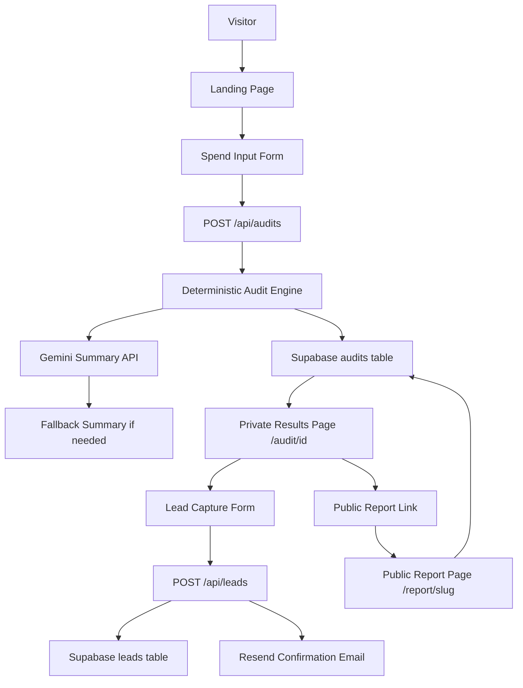

# Architecture

## System Diagram

## Data Flow

1. A user enters AI tools, plans, monthly spend, seats, team size, and primary use case.
2. The form validates input with React Hook Form and Zod.
3. `/api/audits` converts the form into an `AuditInput` and runs the deterministic audit engine.
4. The audit engine calculates plan-fit recommendations, duplicate tool signals, seat cleanup opportunities, and Credex qualification.
5. Gemini generates a short summary using only the computed audit result. If Gemini is unavailable, a templated fallback summary is used.
6. The audit is stored in Supabase with a `public_slug` when Supabase is configured.
7. The private results page shows savings, per-tool recommendations, summary, lead capture, and a share link.
8. The lead form captures email after value is shown, stores the lead, and sends a Resend confirmation email when configured.
9. `/report/[slug]` renders only public audit data. It does not expose email, company, role, or private lead details.

## Stack Choices

- **Next.js App Router:** server routes, dynamic metadata, public report pages, and deployment fit the assignment well.
- **TypeScript:** audit recommendations and pricing logic need explicit types to stay debuggable.
- **Tailwind CSS:** fast custom UI without relying on a prebuilt dashboard template.
- **React Hook Form + Zod:** lightweight form state with runtime validation.
- **Supabase:** real backend storage for audits and leads with simple SQL tables.
- **Resend:** simple transactional email for report confirmation.
- **Gemini:** used for the required AI summary because it has a practical free API path. The PDF prefers Anthropic but allows any LLM.
- **Vitest:** fast deterministic tests for audit logic and summary fallback behavior.

## Deterministic Audit Logic

The AI model does not calculate savings. Savings come from hardcoded pricing data and explicit rules:

- team-size fit
- seats greater than team size
- same-vendor downgrade
- listed-price overspend
- duplicate coding assistant consolidation
- high API spend credit-fit recommendation

The Gemini summary only summarizes the already-computed result.

## Abuse Protection

The lead form includes a hidden honeypot field named `website`. If it is filled, the API returns success without storing or emailing the lead. This is low-friction for legitimate users and enough for an MVP. At higher scale, this should be paired with IP/email rate limiting.

## Scaling To 10k Audits/Day

- Move rate limiting to Redis or Upstash.
- Queue Resend emails in a background job instead of sending inline.
- Add analytics events for form start, audit completion, lead capture, and share clicks.
- Cache public reports at the edge.
- Add database indexes on `public_slug`, `created_at`, and high-savings filters.
- Store pricing data in a versioned table or package so old reports can preserve the exact pricing snapshot used.
- Add structured logging and alerting around failed audit storage, summary fallback rates, and email delivery failures.
