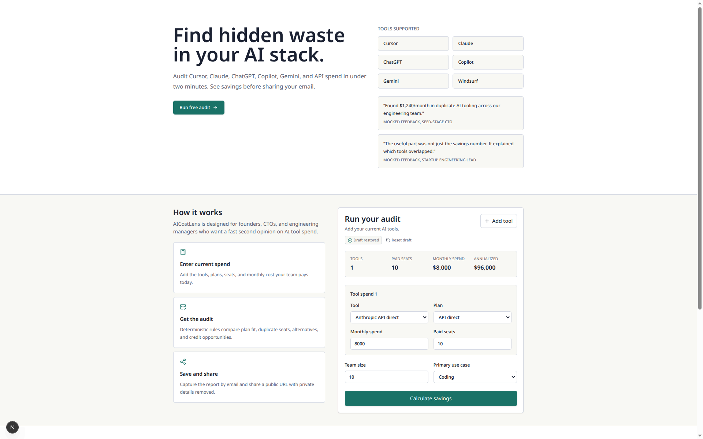
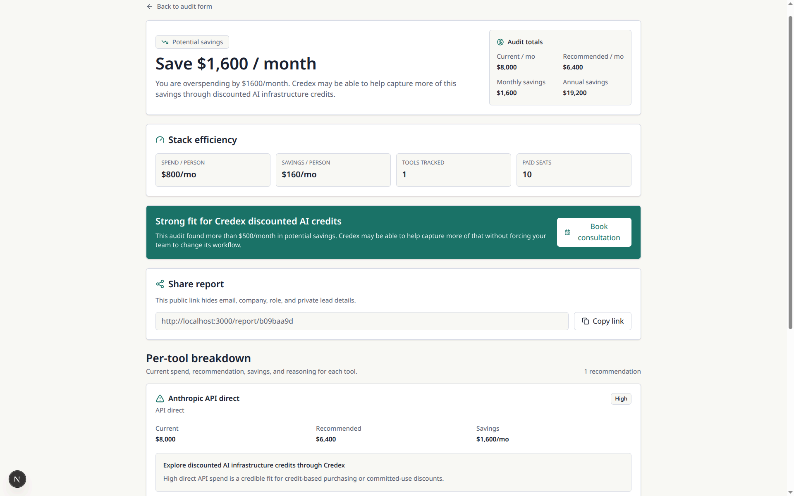
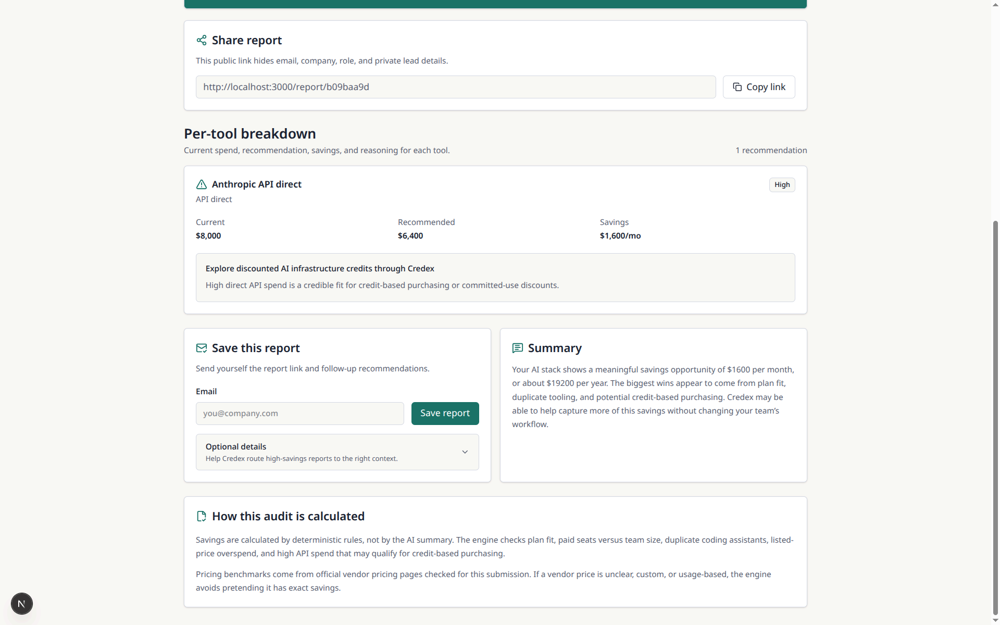
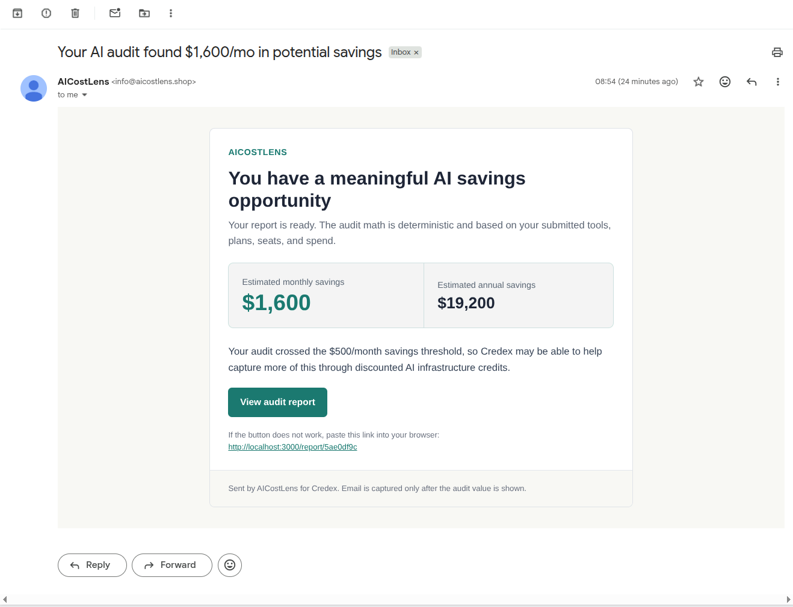
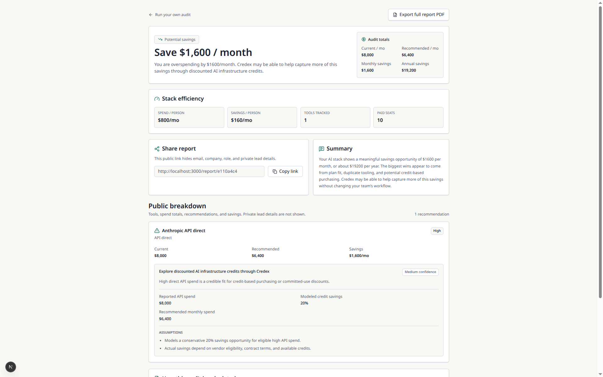
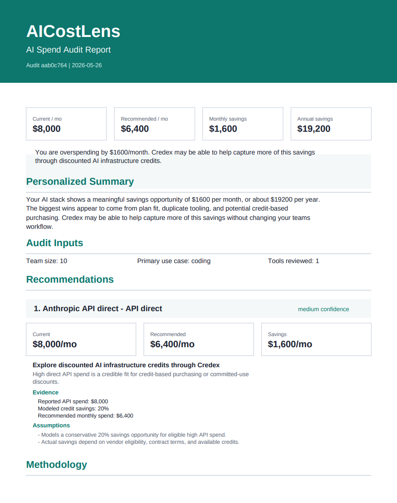

# AICostLens

AICostLens is a free AI spend audit tool for startup founders, CTOs, and engineering managers who want to find hidden waste across Cursor, Claude, ChatGPT, Copilot, Gemini, Windsurf, and AI API usage. It calculates deterministic plan-fit recommendations, estimates monthly and annual savings, captures leads only after showing value, and creates privacy-safe public reports.

Live: https://aicostlens.shop/

## Screenshots

### Landing Page And Audit Form



### Audit Results



### Lead Capture And Sharing



### Transactional Email



### Public Report



### PDF Report Export



## Quick Start

```bash
npm install
npm run dev
```

Open `http://localhost:3000`.

## Environment Variables

Copy `.env.example` to `.env.local`.

```env
NEXT_PUBLIC_APP_URL=http://localhost:3000
NEXT_PUBLIC_SUPABASE_URL=
NEXT_PUBLIC_SUPABASE_ANON_KEY=
SUPABASE_SERVICE_ROLE_KEY=
GEMINI_API_KEY=
RESEND_API_KEY=
RESEND_FROM_EMAIL=
```

## Database

Create the Supabase tables by running the SQL in:

```txt
supabase/migrations/20260524000000_create_audits_and_leads.sql
```

Or, if `SUPABASE_DB_URL` is available in your shell:

```bash
npm run db:migrate
```

## Scripts

```bash
npm run lint
npm run test
npm run build
```

## Lighthouse

Run Lighthouse against the deployed production URL or a local production server, not `npm run dev`.

```bash
npm run build
npm run start
```

Then audit `http://localhost:3000` in an incognito window, or audit the live URL: `https://aicostlens.shop/`. Dev mode includes Next.js devtools, WebSocket connections, Turbopack chunks, and unminified JavaScript, which can make mobile performance look much worse than production.

## Deploy

Deploy on Vercel or an equivalent Next.js host.

1. Add the environment variables in the hosting dashboard.
2. Run the Supabase migration.
3. Set `NEXT_PUBLIC_APP_URL` to the deployed URL.
4. Confirm `/`, `/audit/[id]`, `/report/[slug]`, and API routes work.
5. Verify GitHub Actions CI is green on the latest commit.

## Decisions

1. **Next.js App Router:** chosen for API routes, dynamic metadata, public report pages, and simple Vercel deployment.
2. **Deterministic audit engine:** savings are calculated by hardcoded rules and sourced pricing data, not by an LLM. Tool recommendations include confidence, numeric evidence, and assumptions so the logic is easier to audit.
3. **Gemini for summary:** the PDF prefers Anthropic but allows any LLM; Gemini was selected because it has a practical free API path. A templated fallback is always available.
4. **Email after value:** users see the audit before lead capture; saving by email unlocks share and PDF actions.
5. **Supabase + Resend:** fast real backend and transactional email without building custom infrastructure.

## Bonus Features

- Server-generated PDF export for saved reports, plus print fallback for local-only reports.
- Benchmark strip showing current spend per person, potential savings per person, tool count, and paid seats.
- Launch blog post and X/Twitter thread draft in `LAUNCH_POST.md`.

## Privacy

Public reports show tools, spend totals, savings, recommendations, and summary text. They do not show email, company name, role, or private lead details.
